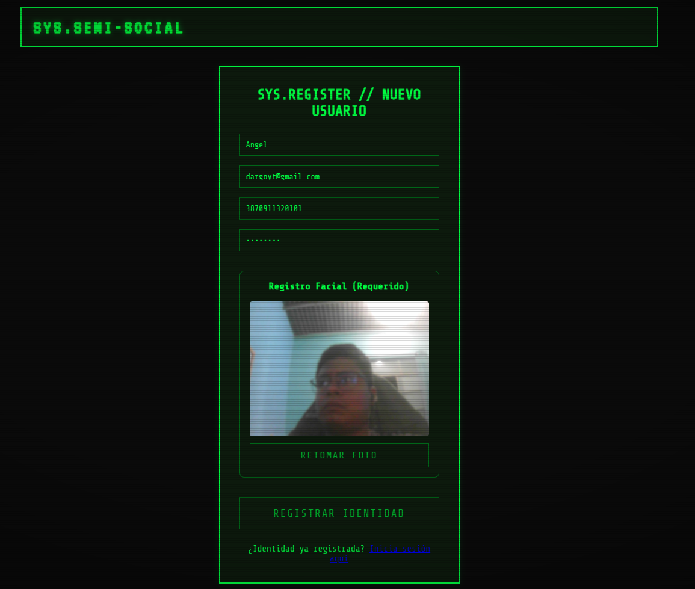
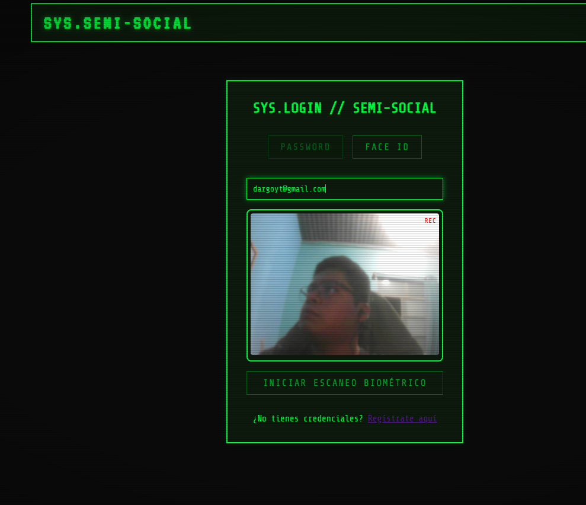
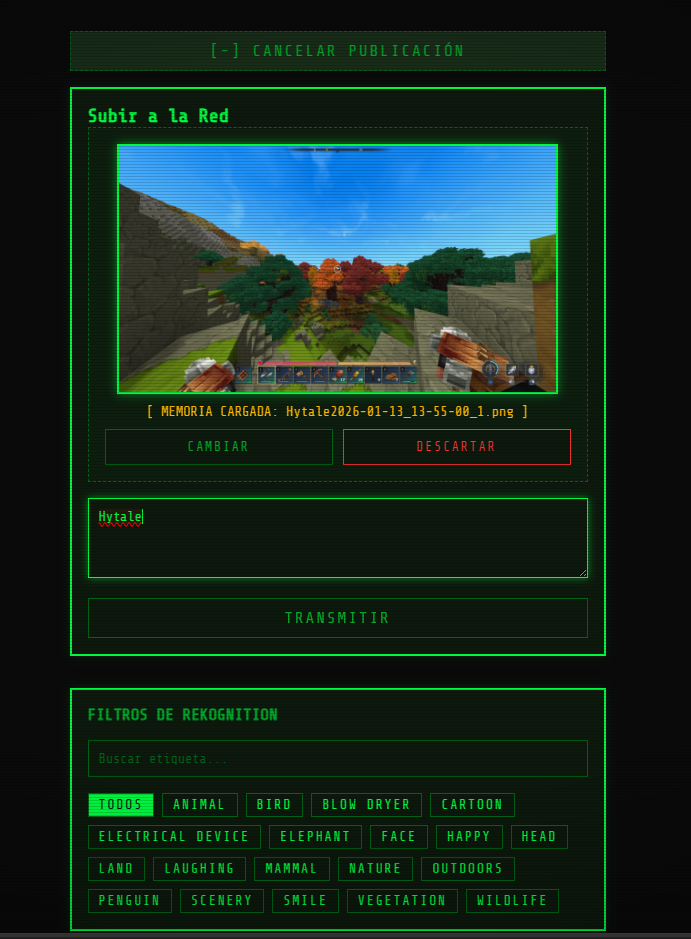
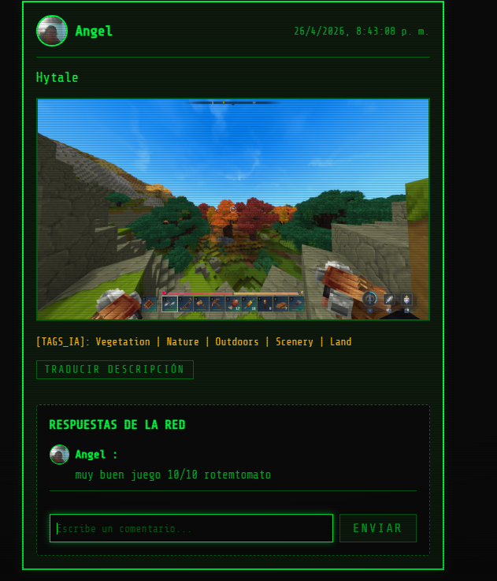
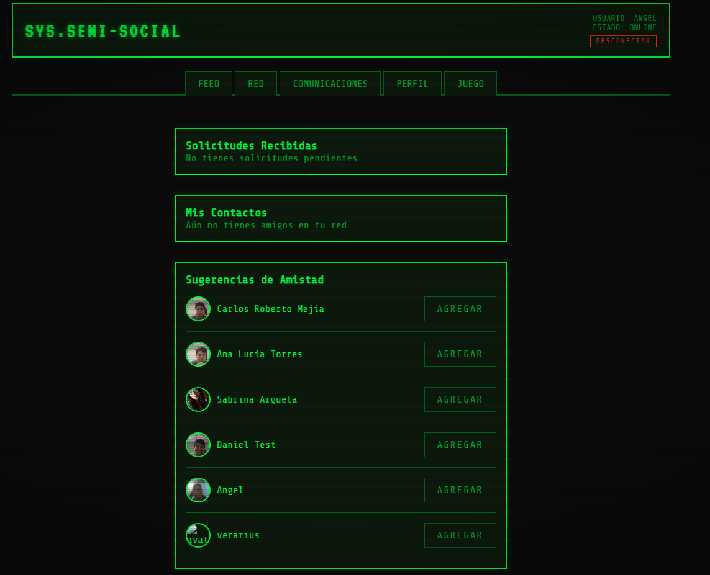
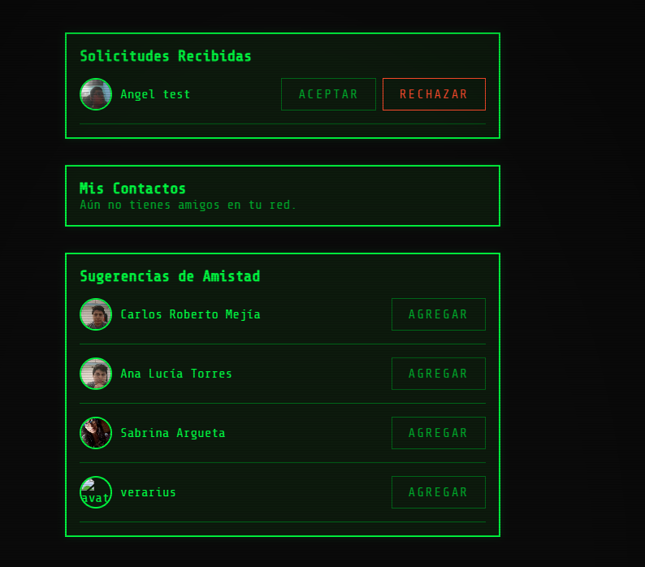
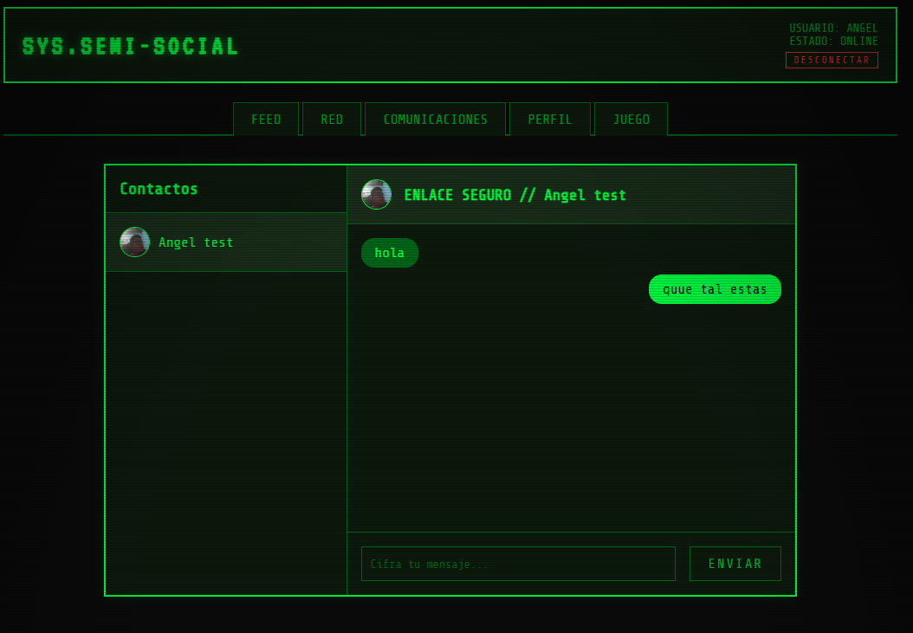
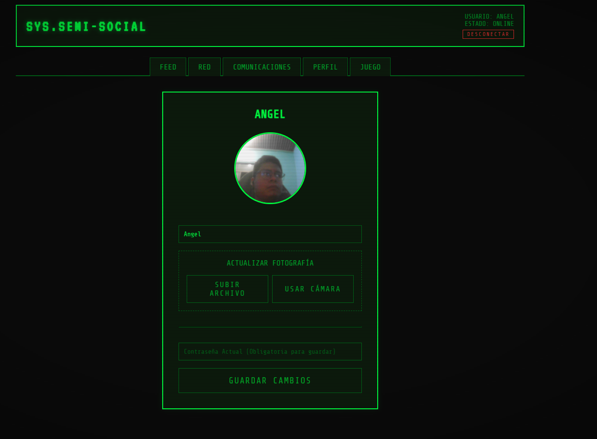
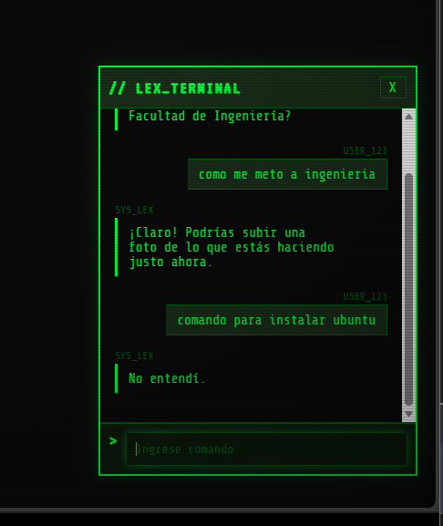
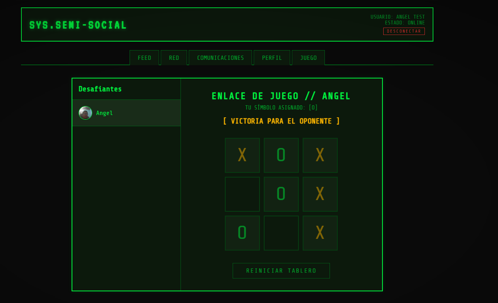

#  Manual de Usuario - Plataforma SYS.SEMI-SOCIAL

Bienvenido al manual de usuario de **SYS.SEMI-SOCIAL**, una red social segura con estética de terminal (Cyberpunk/Retro-Tech) y potenciada por Inteligencia Artificial de AWS. A continuación, se detallan los módulos y flujos de uso de la plataforma.

---

## 1. Registro e Identidad Biómetrica
Para acceder a la red, todo usuario debe ser registrado en la base de datos central.

1. Dirígete a la sección de **SYS.REGISTER**.
2. Completa los campos obligatorios: Nombre, Correo Electrónico, DPI (13 dígitos) y Contraseña segura.
3. En la sección **Registro Facial**, la plataforma solicitará acceso a tu cámara web.
4. Alinea tu rostro y captura la fotografía (puedes volver a tomarla con el botón `RETOMAR FOTO`).
5. Haz clic en `REGISTRAR IDENTIDAD` para finalizar y guardar tu perfil biométrico en la nube.

---

## 2. Acceso al Sistema (Login)
La plataforma cuenta con un sistema de autenticación dual (MFA Biométrico).

1. Ingresa a **SYS.LOGIN**.
2. Selecciona tu método de autenticación en las pestañas superiores:
   * **PASSWORD:** Ingresa tu correo y contraseña tradicional.
   * **FACE ID:** Ingresa tu correo, activa la cámara y haz clic en `INICIAR ESCANEO BIOMÉTRICO`. El sistema validará tu identidad mediante reconocimiento facial (AWS Rekognition) comparándolo con tu foto de registro.

---

## 3. Generación de Contenido (Subir a la Red)
Comparte imágenes y pensamientos con tu red de contactos.

1. Ve a la sección **FEED** o utiliza el módulo de publicación rápida.
2. Carga una memoria (imagen) desde tu dispositivo.
3. Redacta una descripción en la terminal de texto.
4. Haz clic en `TRANSMITIR` para enviar la publicación a la red.
5. El sistema procesará tu imagen automáticamente, extrayendo **Filtros de Rekognition** (etiquetas de objetos detectados en la foto) que podrás usar para filtrar el contenido del feed.

---

## 4. Feed Social, IA y Comentarios
Explora el contenido de tu red, interactúa y supera las barreras del idioma.

* **Visualización:** Observa las publicaciones ordenadas cronológicamente junto con los `[TAGS_IA]` detectados automáticamente.
* **Traducción en Tiempo Real:** Si la descripción está en otro idioma, utiliza el botón `TRADUCIR DESCRIPCIÓN` para convertir el texto a tu idioma nativo utilizando AWS Translate.
* **Interacción:** Responde a la publicación escribiendo en el área de `RESPUESTAS DE LA RED` y presiona `ENVIAR` para dejar tu comentario.

---

## 5. Gestión de Red de Amigos
Descubre otros usuarios y administra tus conexiones.

* **Sugerencias de Amistad:** El sistema te mostrará usuarios registrados que aún no están en tu red. Haz clic en `AGREGAR` para enviarles una solicitud.
* **Solicitudes Recibidas:** Podrás revisar quién desea conectar contigo. Tienes las opciones de `ACEPTAR` o `RECHAZAR`.
* **Mis Contactos:** Una vez aceptada una solicitud, el usuario pasará a tu lista de contactos habilitados para mensajería privada.

---

## 6. Comunicaciones (Chat Seguro)
Inicia conversaciones cifradas en tiempo real con tus contactos aprobados.

1. Navega a la pestaña **COMUNICACIONES**.
2. Selecciona un usuario de tu lista de contactos en el panel lateral izquierdo.
3. En el panel de **ENLACE SEGURO**, redacta tu mensaje en la terminal inferior y presiona `ENVIAR`.
4. El historial se mantiene sincronizado de forma instantánea.

---

## 7. Edición de Perfil
Mantén tu información actualizada bajo estrictos protocolos de seguridad.

1. Ingresa a la pestaña **PERFIL**.
2. Modifica tu nombre de usuario si lo deseas.
3. En la sección **ACTUALIZAR FOTOGRAFÍA**, puedes elegir subir un archivo local o utilizar tu cámara web para cambiar tu imagen de referencia biométrica.
4. **Requisito de Seguridad:** Para aplicar cualquier cambio, es **obligatorio** ingresar tu Contraseña Actual en la consola inferior antes de presionar `GUARDAR CAMBIOS`.

---

## 8. Asistente Terminal Lex
Un bot conversacional integrado para ayudarte a navegar o consultar información.

1. Abre la ventana **LEX_TERMINAL**.
2. Escribe tu comando o pregunta (por ejemplo, dudas sobre la facultad, instalaciones, etc.).
3. El sistema (AWS Lex) procesará el lenguaje natural y te devolverá las instrucciones o respuestas correspondientes.

---

## 9. Módulo de Juego (Arcade)
Desafía a tu red a una partida de Totito (Tic-Tac-Toe).

1. Dirígete a la pestaña **JUEGO**.
2. Selecciona un desafiante de tu lista de contactos.
3. El sistema establecerá un **ENLACE DE JUEGO** asignándote un símbolo (`X` o `O`).
4. Interactúa con el tablero haciendo clic en las casillas. El sistema anunciará la victoria o empate, y podrás utilizar el botón `REINICIAR TABLERO` para una revancha.
