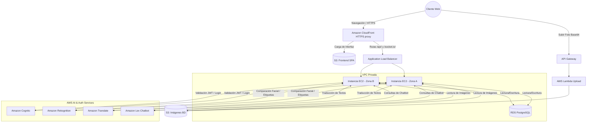

# Manual Técnico

## Descripción de la Arquitectura

El sistema "Semi-Social" se construyó sobre **Amazon Web Services (AWS)** utilizando una arquitectura distribuida, de alta disponibilidad y desplegada íntegramente a través de Infraestructura como Código (IaC).

* **Infraestructura como Código (IaC):** Toda la red (VPC, Subredes públicas, IGW), bases de datos, servidores, buckets y políticas de seguridad fueron aprovisionados y gestionados automáticamente mediante **Terraform**.

* **Frontend y Distribución (CDN):** Aplicación Single Page Application (SPA) construida con React (Vite). Cuenta con una interfaz de usuario inmersiva basada en una terminal retro-futurista (Pip-Boy CRT). Está alojada en un bucket **Amazon S3** privado y expuesta globalmente mediante **Amazon CloudFront** utilizando Control de Acceso de Origen (OAC) para garantizar que el bucket no sea público.

* **Enrutamiento Avanzado (Proxy Inverso):** Para evitar errores de contenido mixto (Mixed Content) sin requerir dominios personalizados externos, CloudFront actúa como proxy. Las peticiones a la raíz despachan el frontend en S3, mientras que las rutas `/api/*` y `/socket.io/*` son redirigidas internamente vía HTTP hacia el Balanceador de Carga, entregando todo el sistema bajo un único certificado HTTPS gratuito de AWS.

* **Backend:** API REST y servidor de WebSockets desarrollado en Node.js, alojado en dos instancias **Amazon EC2** (Ubuntu). Estas operan detrás de un **Application Load Balancer (ALB)** que distribuye el tráfico en múltiples zonas de disponibilidad (us-east-1a, us-east-1b).

* **Base de Datos:** **Amazon RDS (PostgreSQL)** alojada en un grupo de subredes privado/protegido, encargada de la persistencia relacional de usuarios, publicaciones, etiquetas, comentarios y amistades. Se almacenan hashes MD5 para cumplir con normativas de evaluación.

* **Almacenamiento de Imágenes (S3 + Lambda):** Carga descentralizada de imágenes (perfiles y publicaciones) mediante **Amazon API Gateway** conectado a una función **AWS Lambda** (`image_upload_handler`). La Lambda procesa el Base64 y lo almacena de forma segura en S3, retornando la URL pública.

* **Autenticación Biométrica y Tradicional:** Integración con **Amazon Cognito** para la emisión y validación de tokens. Además, se utiliza **Amazon Rekognition** (CompareFaces) para permitir el acceso mediante reconocimiento facial comparando la foto en vivo con la de S3.

* **Procesamiento de Inteligencia Artificial:**
    * **Amazon Rekognition:** Análisis de imágenes subidas al Feed para generar etiquetas (tags) automáticas que permiten el filtrado de publicaciones.
    * **Amazon Translate:** Traducción en tiempo real de las descripciones de las publicaciones y comentarios a múltiples idiomas (Inglés, Francés, Portugués).

* **Comunicación Bidireccional:**
    * **WebSockets (Socket.io):** Implementados sobre el ALB con resiliencia a micro-desconexiones. Soportan el chat en tiempo real en salas privadas y la transmisión de eventos de estado ("Escribiendo...").
    * **Amazon Lex:** Chatbot interactivo integrado en el frontend que responde dudas administrativas y académicas sobre la facultad de ingeniería.

---

## Seguridad, Usuarios IAM y Roles

El proyecto sigue el principio de privilegio mínimo (PoLP). Los recursos se comunican entre sí utilizando roles de ejecución asumidos dinámicamente, configurados a través de Terraform.

### Roles de Servicio (Assumed Roles)

* **Role-EC2-AI-Backend (`ec2_ai_role_g9`)**
    * **Propósito:** Asignado a las instancias EC2 mediante un Instance Profile. Permite al backend invocar los servicios de IA y autenticación de AWS sin necesidad de almacenar credenciales (Access Keys) en el código.
    * **Políticas Adjuntas:**
        * `AmazonRekognitionFullAccess`: Para análisis de etiquetas y comparación facial en el login.
        * `TranslateReadOnly`: Para el endpoint de traducción de publicaciones.
        * `AmazonLexRunBotsOnly`: Para enviar el texto del usuario al modelo de Lex y recibir respuestas.
        * `AmazonS3ReadOnlyAccess`: Para recuperar las imágenes base en la comparación facial.
        * `AmazonCognitoPowerUser`: Para validar credenciales (InitiateAuth) y forzar la verificación de correos en el registro.

* **Role-Lambda-S3 (`lambda_s3_role_g9`)**
    * **Propósito:** Asignado a la función Lambda encargada de la subida de archivos.
    * **Políticas Adjuntas:**
        * `AWSLambdaBasicExecutionRole`: Para permitir la ejecución de la función y la escritura de logs en CloudWatch.
        * `AmazonS3FullAccess` (Restringido al bucket específico): Para permitir el guardado del buffer de imagen procesado en las carpetas `fotosPerfil` y `Fotos_Publicadas`.

### Configuración de Red (Security Groups)

El flujo de tráfico está estrictamente controlado a nivel de red para evitar exposición directa de servicios críticos. La siguiente imagen muestra la configuración de Security Groups dentro de la VPC:

* **ALB Security Group (`alb_sg`):** Permite tráfico entrante en los puertos 80 y 443 desde cualquier origen (0.0.0.0/0). En este caso, recibe las peticiones originadas por CloudFront.
* **EC2 Security Group (`ec2_sg`):** Permite tráfico en el puerto del backend (ej. 3000) **exclusivamente** desde el Security Group del ALB. Ningún usuario externo puede golpear directamente las instancias. Incluye puerto 22 para administración SSH.
* **RDS Security Group (`rds_sg`):** Permite tráfico en el puerto 5432 (PostgreSQL) **exclusivamente** desde el Security Group de las instancias EC2. La base de datos es inaccesible desde internet.

---

## Diagrama de Arquitectura AWS

El siguiente diagrama ilustra el flujo de peticiones y la topología de red de los servicios implementados en Amazon Web Services.

---

## Flujo del Sistema y Experiencia de Usuario (User Journey)

La plataforma "Semi-Social" ofrece una experiencia de usuario fluida y estructurada en diferentes módulos. A continuación se detalla el árbol de navegación y las opciones disponibles para un usuario registrado.

### 1. Módulo de Acceso (Autenticación)
* **Registro de Usuario:** Permite crear una cuenta ingresando DPI (único), Nombre, Correo, Contraseña y captura de fotografía en vivo (vía cámara web o archivo) que servirá como base para el modelo biométrico.
* **Login Tradicional:** Acceso mediante validación de credenciales (Correo y Contraseña) contra Amazon Cognito.
* **Login Facial (Biométrico):** Acceso sin contraseña. El usuario captura una foto en vivo con su cámara, el sistema consulta Amazon Rekognition para comparar las facciones con la foto de perfil registrada con un umbral de similitud estricto.

### 2. Módulo Principal (Feed de Red Social)
* **Crear Transmisión (Publicación):** Interfaz colapsable para subir una imagen y texto. La imagen pasa por Amazon Rekognition en el backend, el cual extrae automáticamente etiquetas (tags) basándose en el contenido visual.
* **Visualización y Filtros:** El usuario puede visualizar las publicaciones de toda la red ordenadas cronológicamente. Incluye un buscador y botones de filtros dinámicos basados en las etiquetas generadas por IA.
* **Traducción Bajo Demanda:** Cada publicación y comentario cuenta con un botón para invocar a Amazon Translate, devolviendo el texto original traducido a Inglés, Francés y Portugués.
* **Interacción (Comentarios):** Cada publicación despliega un hilo de respuestas donde los usuarios pueden interactuar.

### 3. Módulo de Red (Gestión de Contactos)
* **Sugerencias de Amistad:** Lista de usuarios registrados en el sistema que aún no tienen un vínculo con el usuario activo. Permite enviar una solicitud.
* **Solicitudes Recibidas:** Panel de control para aceptar o rechazar invitaciones pendientes.
* **Mis Contactos:** Lista de amistades confirmadas, con la opción de dar de baja (eliminar) la conexión, lo que revoca el acceso al canal de chat privado.

### 4. Módulo de Comunicaciones (Chat Seguro)
* **Túnel WebSockets:** Chat en tiempo real bidireccional y privado (Salas de Socket.io).
* **Indicador de Actividad:** Transmisión de estado ("Transcribiendo...") que notifica en tiempo real cuando la otra persona está redactando un mensaje.
* **Historial Persistente:** Recuperación automática de mensajes anteriores al abrir un canal seguro con un contacto.

### 5. Módulo de Perfil y Sistema
* **Gestión de Perfil:** Permite actualizar el Nombre y la Fotografía (tomando una nueva en vivo o subiendo archivo). Requiere confirmación obligatoria de la contraseña actual. El DPI permanece bloqueado para garantizar la integridad de los datos.
* **Asistente Inteligente (LexBot):** Terminal global flotante disponible en cualquier pantalla. El usuario ingresa comandos en texto natural y el bot responde a dudas relacionadas con la Facultad de Ingeniería y soporte administrativo.

---

## Flujo de Despliegue (CI/CD Manual)

1.  **Infraestructura:** Ejecución de `terraform apply` para aprovisionar RDS, EC2, ALB, API Gateway, S3 y CloudFront.
2.  **Backend:** Conexión SSH a las instancias EC2 creadas, clonación del repositorio, configuración de variables de entorno (ARN de Cognito, credenciales de BD) e inicialización del proceso con `pm2`.
3.  **Frontend:** Compilación estática del proyecto React (`npm run build`) configurando el endpoint raíz para que apunte al dominio de CloudFront.
4.  **Distribución:** Sincronización del directorio de compilación (`dist`) con el bucket de S3 del frontend mediante AWS CLI (`aws s3 sync`) y purga de caché de CloudFront (`aws cloudfront create-invalidation`) para reflejar los cambios globalmente.